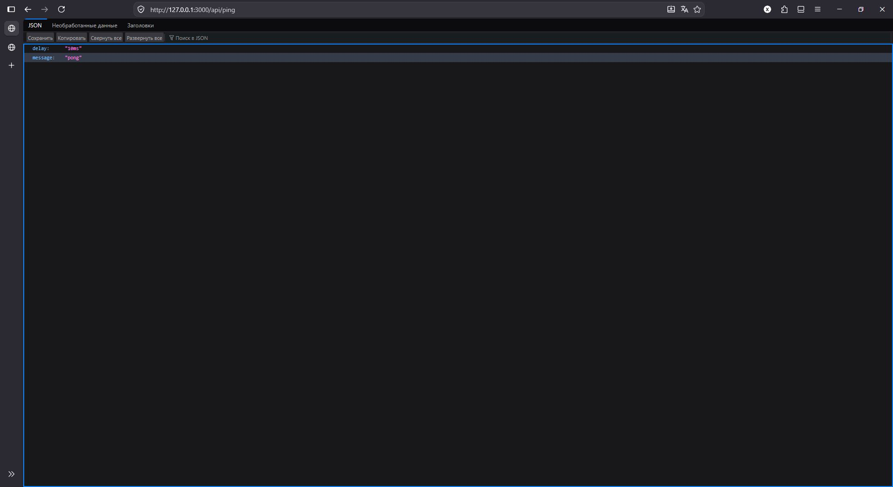
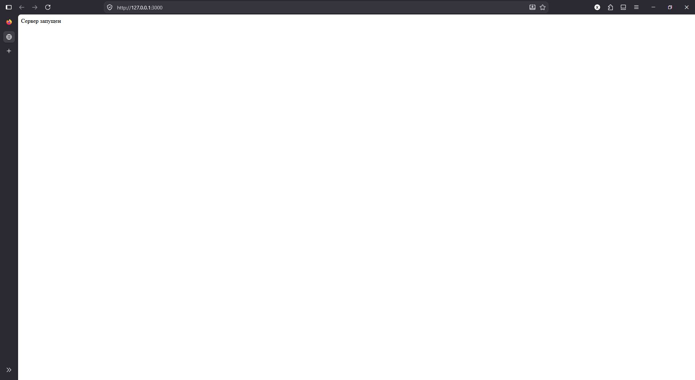
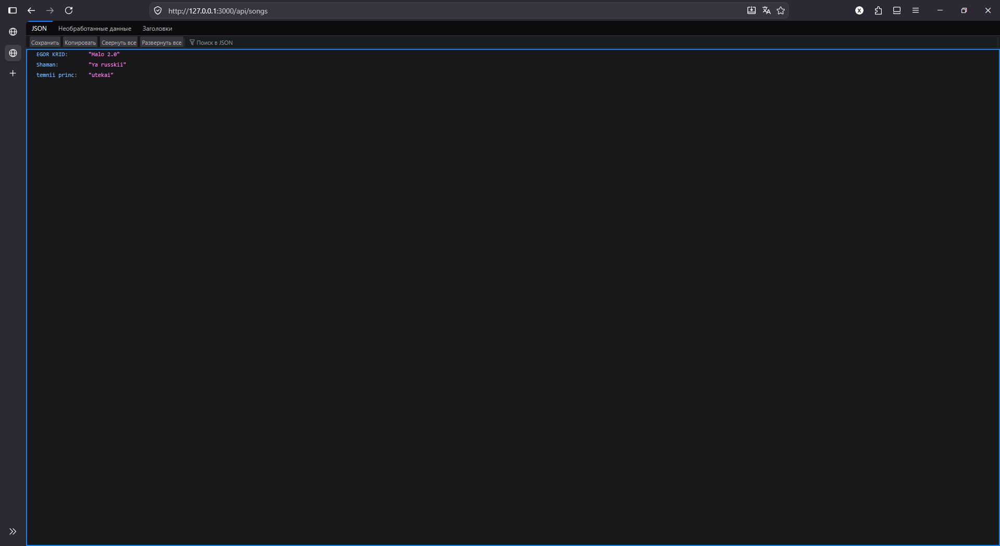
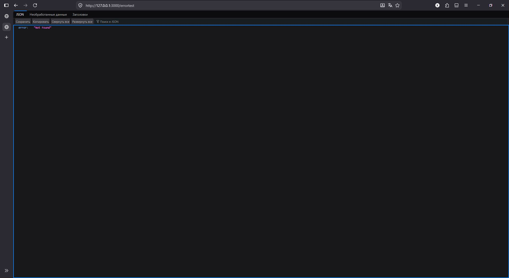
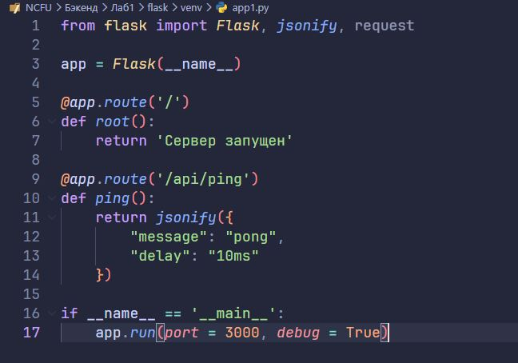
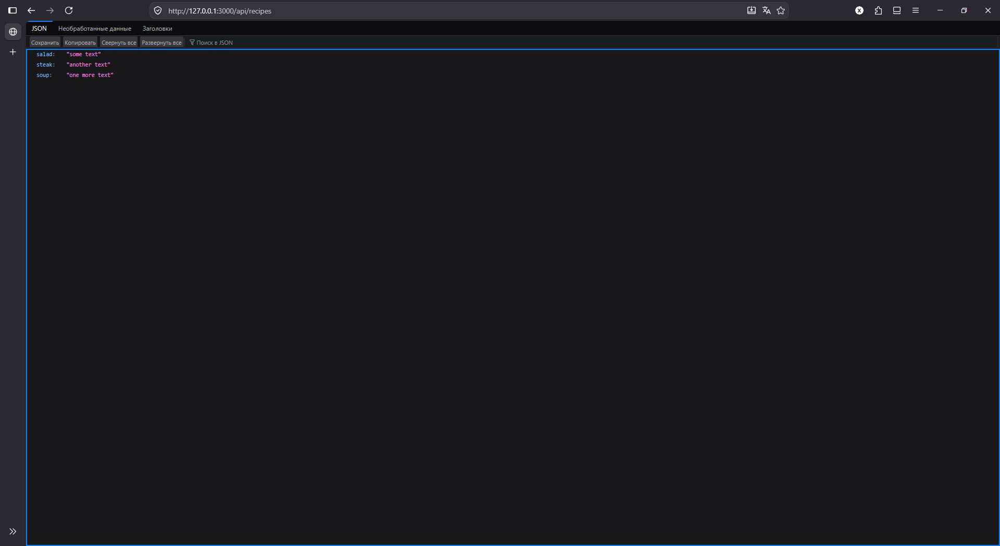
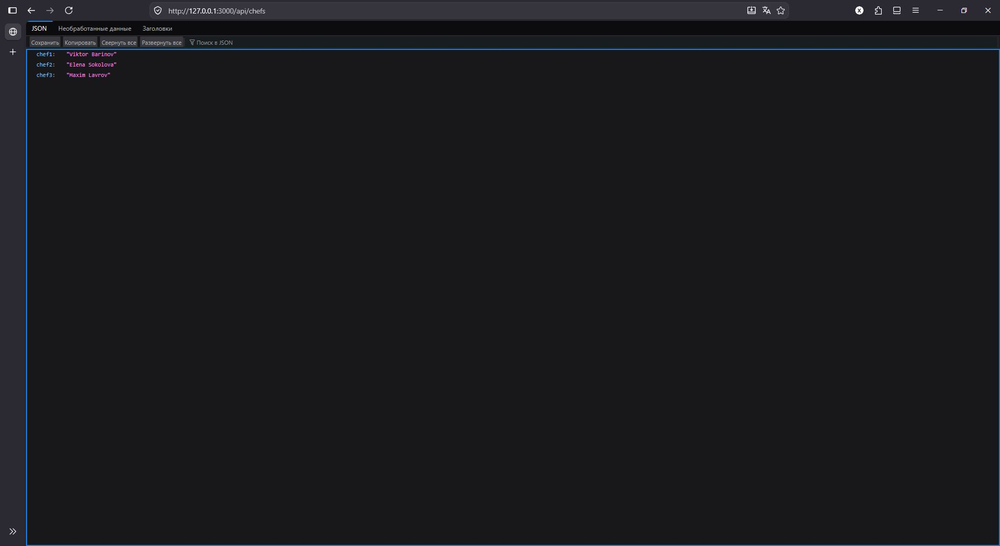
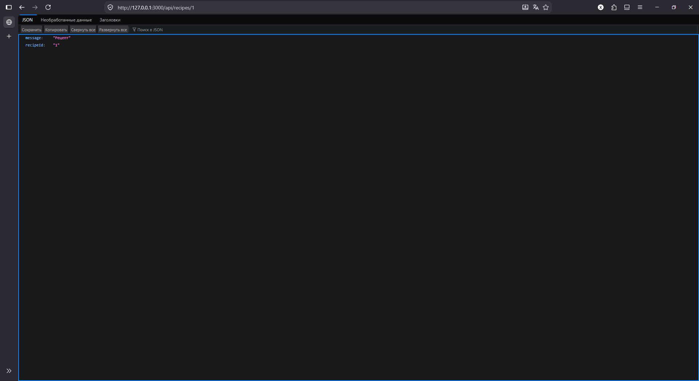

# Лабораторная работа №1: Настройка среды разработки и первый HTTP-сервер

**Студент:** Хвостов Ростислав Романович

**Группа:** ПИЖ-б-о-25-2

**Вариант:** 11

**Технология:** Python + Flask / Node.js + Express

## Цель работы
Освоить установку инструментов для бэкенд-разработки, создать и запустить минимальный веб-сервер, обрабатывающий GET-запросы, понять концепцию эндпоинтов, научиться настраивать автоматический перезапуск сервера.

## Теоретическое обоснование
- Эндпоинт - это конкретный адрес вместе с методом HTTP, по которому клиент обращается к серверу для получения ресурса.\
- Маршрут - это механизм сопоставления пути запроса с кодом обработчика на стороне сервера.
- HTTP - основной протокол передачи данных в интернете.
- JSON (JavaScript Object Notation) - текстовый формат обмена данными, который стал стандартом де-факто для REST API.

## Индивидуальные задания

### Задание 1.
```python
from flask import Flask, jsonify, request

app = Flask(__name__)

@app.route('/')
def root():
    return 'Сервер запущен'

@app.route('/api/ping')
def ping():
    return jsonify({
        "message": "pong",
        "delay": "10ms"
    })

if __name__ == '__main__':
    app.run(port = 3000, debug = True)
```

Эндпоинт "/"


Эндпоинт "/api/ping"

### Задание 2.
```python
from flask import Flask, jsonify, request

app = Flask(__name__)

@app.route('/')
def root():
    return 'Сервер запущен'

@app.route('/api/songs')
def songs():
    return jsonify({
        "Shaman": "Ya russkii",
        "temnii princ": "utekai",
        "EGOR KRID": "Malo 2.0"
    })

@app.route('/api/albums')
def albums():
    return jsonify({
        "Shaman": "ROSSIYA",
        "temnii princ": "MILITANTUM",
        "EGOR KRID": "<3"
    })

@app.errorhandler(404) 
def error404(error): 
    return jsonify({ "error": "Not Found" }), 404 

if __name__ == '__main__':
    app.run(port = 3000, debug = True)
```

Эндпоинт "/"


Эндпоинт "/api/songs"


Эндпоинт "/api/albums"


Ошибка 404

### Задание 3.
```javascript
const express = require('express');
const app = express();
const port = 3000;

app.use((req, res, next) => {
  console.log(`[${new Date().toISOString()}] ${req.method} ${req.url}`);
  next();
});

app.get('/', (req, res) => {
  res.send('Сервер запущен');
});

app.get('/api/recipes', (req, res) => {
  res.json({
    salad: "some text",
    steak: "another text",
    soup: "one more text"
  });
});

app.get('/api/chefs', (req, res) => {
  res.json({
    chef1: "Viktor Barinov",
    chef2: "Elena Sokolova",
    chef3: "Maxim Lavrov"
  });
});

app.get('/api/recipes/:id', (req, res) => {
  res.json({
    message: "Рецепт",
    recipeId: req.params.id
  });
});

app.use((req, res) => {
  res.status(404).json({ error: 'Not Found' });
});

app.listen(port, () => {
  console.log(`Сервер запущен на http://localhost:${port}`);
});
```

Эндпоинт "/"


Эндпоинт "/api/recipes"


Эндпоинт "/api/chefs"


Эндпоинт "/api/recipes/1"


Ошибка 404

## Контрольные вопросы
1. Что такое клиент-серверная архитектура?
Ответ: Это модель, где клиент отправляет запросы, а сервер их обрабатывает и возвращает ответ.

2. Какой протокол используется для общения клиента и сервера в вебе?
Ответ: HTTP (или его защищённая версия HTTPS).

3. Что такое эндпоинт (endpoint)?
Ответ: Это конкретный URL-адрес, по которому сервер принимает запросы и выполняет определённое действие.

4. Какую структуру имеет HTTP-запрос и HTTP-ответ? Что такое код состояния (status code)?
Ответ: Запрос содержит метод, URL, заголовки и тело; ответ - заголовки, тело и код состояния. Код состояния - это число, показывающее результат обработки запроса.

5. Что такое JSON? Почему он популярен в веб-разработке?
Ответ: JSON - это текстовый формат обмена данными. Он популярен, потому что лёгкий, читаемый и легко парсится в любом языке.

6. Как запустить сервер на Node.js или Flask?
Ответ: В Node.js - создать файл с сервером и выполнить `node server.js`. Во Flask - создать файл с приложением и выполнить `flask run` или `python app.py`.

7. Что такое автоматический перезапуск сервера и зачем он нужен? Какой пакет используется для Node.js?
Ответ: Это автоперезапуск сервера при изменении кода, чтобы не делать это вручную. Для Node.js используется пакет nodemon.

8. Какие коды состояния HTTP вы знаете? За что отвечает код 404?
Ответ: Например, 200 - успех, 301 - редирект, 400 - страница не найдена, 500 - ошибка со стороны сервера. Код 404 означает, что запрошенный ресурс не найден.

9. Что такое middleware в Express / декораторы запросов во Flask (для продвинутого уровня)?
Ответ: Middleware в Express - это функции, выполняемые между запросом и ответом. Во Flask похожую роль играют декораторы, например @app.before_request.

10. Как получить параметр из URL-пути (например, ID пользователя) в вашем фреймворке?
Ответ: В Express - через req.params.id, во Flask - через аргумент функции, например @app.route('/user/<int:id>').

## Вывод
Освоили установку инструментов для бэкенд-разработки, создали и запустить минимальный веб-сервер, обрабатывающий GET-запросы, поняли концепцию эндпоинтов, научились настраивать автоматический перезапуск сервера.

## Список источников
1. **Node.js официальная документация** — https://nodejs.org/en/docs/
2. **Express официальная документация** — https://expressjs.com/
3. **Flask официальная документация** — https://flask.palletsprojects.com/
4. **HTTP протокол (MDN)** — https://developer.mozilla.org/ru/docs/Web/HTTP
5. **JSON (MDN)** —
https://developer.mozilla.org/ru/docs/Web/JavaScript/Reference/Global_Objects/JS
ON
6. **Nodemon документация** — https://nodemon.io/
7. **Postman документация** — https://learning.postman.com/docs/getting-
started/introduction/
8. **REST API — основные принципы (GeeksforGeeks)** —
https://www.geeksforgeeks.org/node-js/explain-the-concept-of-restful-apis-in-
express
